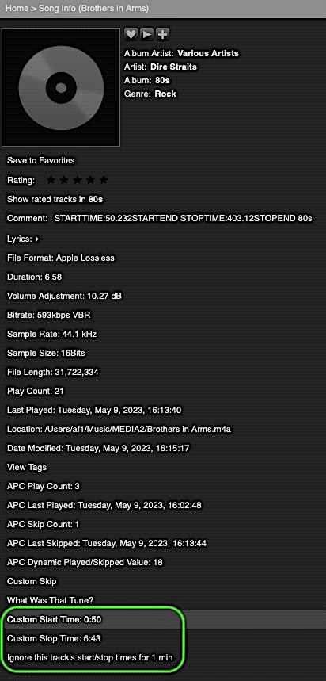

Custom Start Stop Times
====

With **Custom Start Stop Times**[^1] you can start and stop tracks at a specific playback time or skip a specific part of the song (e.g. silence) by simply adding custom start, stop or skip times to a track's *comments tag*. With the help of this plugin, the song will start[^2] or end, i.e. skip to the next one, when you want it to, or skip[^2] an unwanted part. No more annoying song intros or minutes of silence.
  
[⬅️ **Back to the list of all plugins**](https://github.com/AF-1/)
    

## Screenshots[^3]

   

## Requirements

- LMS version >= 7.**9**
- LMS database = **SQLite**
   

## Comment tag patterns

For this plugin to work, you need to add your custom start, stop or skip times to the **comment tag** of the tracks that you wish to start and stop at custom times or skip a specific part of. For a larger number of songs it probably makes sense to use a script (see macOS Music app example below).  
Please use the simple **patterns** listed below. They are **case-sensitive** (use upper case) but it doesn't matter whether your time value has a **comma**, a decimal **point** or neither. 

### Start time
- The pattern is: `STARTTIME:{time}STARTEND` where {time} is your start time
- Example: `STARTTIME:5,3462STARTEND` will make your song start at 5.3462 seconds.

### Stop time
- The pattern is: `STOPTIME:{time}STOPEND` where {time} is your stop time, i.e. when LMS skips to the next song.
- Example: `STOPTIME:248,32STOPEND` will make LMS skip to the next song after 248.32 seconds.
  

### Skip part of the song
You will have to set a skip **start** point **and** a time to which the plugin should jump (skip **stop** point). You need to set both. And you cannot skip multiple parts, just one.
- The skip **start** point pattern is: `SKIPSTART:{time}SKIPSTARTXXX` where {time} is the time when LMS should skip to the skip stop point.

- The skip **stop** point pattern is: `SKIPSTOP:{time}SKIPSTOPXXX` where {time} is the time to which LMS should skip from the skip start point.

- Example: `SKIPSTART:156SKIPSTARTXXX SKIPSTOP:337,2SKIPSTOPXXX` will make LMS jump to the playback position 337.2 seconds in the song after 156 seconds.
 

💡 If you do a **manual jump** inside the currently playing song **beyond the skip *start* point**, **skipping is disabled** for the currently playing song.
   

## Installation

 **Custom Start Stop Times** is available from the LMS plugin library: **LMS > Settings > Manage Plugins**. 

If you want to test a new patch that hasn't made it into a release version yet, you'll have to [install the plugin manually](https://github.com/AF-1/sobras/wiki/Manual-installation-of-LMS-plugins).
   

## Music app (macOS)
If you use the **Music** app on **macOS**, take a look at the simple **Applescript** included in this repository: 
- it can gather songs for which you have set **start** or **stop** times in the Music app in a playlist and
- write those start and stop times to the comment tag of those tracks.

Works for me but use at your own risk :-) 
If you want to run the script on a large number of tracks, consider *exporting* the script as an *app*.[^3]
   

[^3]: If you want the Music app to list your apps and Applescripts in the Scripts menu, you have to place them in `~/Library/Music/Scripts`.

## Reporting a new issue

If you want to report a new issue, please fill out this [**issue report template**](https://github.com/AF-1/lms-customstartstoptimes/issues/new?template=bug_report.md&title=%5BISSUE%5D+).  
If you use this plugin and like it, perhaps you could give it a :star: so that other users can discover it (in their News Feed). Thank you.
    

[^1]:If you want localized strings in your language, please read <a href="https://github.com/AF-1/sobras/wiki/Adding-localization-to-LMS-plugins"><b>this</b></a>.
[^2]:As the LMS source code states: a "jump to a particular time in the current song should be dead-on for CBR, approximate for VBR".
[^3]: The screenshots might not correspond to the UI of the latest release in every detail.
